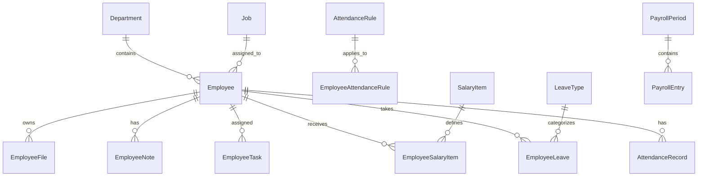

# تطبيق الموارد البشرية (Hr Application)

## نظرة عامة (Application Overview)

تطبيق الموارد البشرية هو التطبيق الأساسي في نظام الدولية، يوفر إدارة شاملة لجميع جوانب الموارد البشرية في الشركة. يتضمن إدارة الموظفين، الحضور والانصراف، الإجازات، الرواتب، وهيكل الشركة.

**الغرض الرئيسي**: إدارة شاملة للموارد البشرية مع دعم كامل للغة العربية ونظام RTL.

## الميزات الرئيسية (Key Features)

### 1. إدارة هيكل الشركة (Company Structure Management)
- إدارة الشركات والفروع
- إدارة الأقسام والوظائف
- هيكل تنظيمي متدرج
- تأمينات الوظائف

### 2. إدارة الموظفين (Employee Management)
- ملفات شاملة للموظفين
- إدارة الوثائق والملفات
- جهات الاتصال في الطوارئ
- تقييمات الأداء
- ملاحظات الموظفين

### 3. نظام الحضور والانصراف (Attendance & Time Tracking)
- قواعد الحضور المرنة
- أجهزة الحضور
- تسجيل الحضور اليدوي والآلي
- تقارير الحضور التفصيلية
- إدارة الورديات

### 4. إدارة الإجازات (Leave Management)
- أنواع الإجازات المختلفة
- طلبات الإجازات
- أرصدة الإجازات
- سير عمل الموافقات

### 5. نظام الرواتب (Payroll System)
- بنود الرواتب المرنة
- هياكل الرواتب للموظفين
- فترات الرواتب
- حسابات الرواتب التلقائية

### 6. إدارة المهام (Task Management)
- مهام الموظفين
- مهام الموارد البشرية
- تتبع التقدم
- التذكيرات

## هيكل النماذج (Models Documentation)

### النماذج الأساسية (Base Models)

#### Department (القسم)
```python
class Department(models.Model):
    name = models.CharField(max_length=100)  # اسم القسم
    code = models.CharField(max_length=20)   # كود القسم
    description = models.TextField()         # وصف القسم
    manager = models.ForeignKey(Employee)    # مدير القسم
    parent = models.ForeignKey('self')       # القسم الأب
    is_active = models.BooleanField()        # نشط
```

#### Job (الوظيفة)
```python
class Job(models.Model):
    name = models.CharField(max_length=100)      # اسم الوظيفة
    code = models.CharField(max_length=20)       # كود الوظيفة
    department = models.ForeignKey(Department)   # القسم
    description = models.TextField()             # وصف الوظيفة
    requirements = models.TextField()            # متطلبات الوظيفة
    salary_range_min = models.DecimalField()     # الحد الأدنى للراتب
    salary_range_max = models.DecimalField()     # الحد الأقصى للراتب
```

#### Car (السيارة)
```python
class Car(models.Model):
    name = models.CharField(max_length=100)      # اسم السيارة
    code = models.CharField(max_length=20)       # كود السيارة
    model = models.CharField(max_length=50)      # الموديل
    year = models.IntegerField()                 # سنة الصنع
    license_plate = models.CharField()           # رقم اللوحة
    capacity = models.IntegerField()             # السعة
    is_active = models.BooleanField()            # نشط
```

### نموذج الموظف (Employee Model)

#### Employee (الموظف)
```python
class Employee(models.Model):
    # المعلومات الأساسية
    employee_id = models.CharField(max_length=20, unique=True)  # رقم الموظف
    first_name = models.CharField(max_length=50)                # الاسم الأول
    last_name = models.CharField(max_length=50)                 # الاسم الأخير
    full_name = models.CharField(max_length=100)                # الاسم الكامل
    
    # المعلومات الوظيفية
    department = models.ForeignKey(Department)                  # القسم
    job = models.ForeignKey(Job)                               # الوظيفة
    hire_date = models.DateField()                             # تاريخ التوظيف
    salary = models.DecimalField()                             # الراتب الأساسي
    
    # المعلومات الشخصية
    national_id = models.CharField(max_length=20)              # الرقم القومي
    birth_date = models.DateField()                            # تاريخ الميلاد
    gender = models.CharField(max_length=10)                   # الجنس
    marital_status = models.CharField(max_length=20)           # الحالة الاجتماعية
    
    # معلومات الاتصال
    phone = models.CharField(max_length=20)                    # الهاتف
    email = models.EmailField()                                # البريد الإلكتروني
    address = models.TextField()                               # العنوان
    
    # الحالة والإعدادات
    status = models.CharField(max_length=20)                   # الحالة
    is_active = models.BooleanField()                          # نشط
    photo = models.ImageField()                                # الصورة الشخصية
```

### نماذج الحضور (Attendance Models)

#### AttendanceRule (قاعدة الحضور)
```python
class AttendanceRule(models.Model):
    name = models.CharField(max_length=100)                    # اسم القاعدة
    description = models.TextField()                           # وصف
    work_schedule = models.JSONField()                         # جدول العمل
    late_grace_minutes = models.PositiveIntegerField()         # فترة سماح التأخير
    early_leave_grace_minutes = models.PositiveIntegerField()  # فترة سماح الانصراف المبكر
    weekly_off_days = models.JSONField()                       # أيام الإجازة الأسبوعية
    is_active = models.BooleanField()                          # نشط
```

#### AttendanceRecord (سجل الحضور)
```python
class AttendanceRecord(models.Model):
    employee = models.ForeignKey(Employee)                     # الموظف
    record_date = models.DateField()                           # تاريخ السجل
    record_time = models.TimeField()                           # وقت السجل
    record_type = models.CharField(max_length=20)              # نوع السجل (دخول/خروج)
    machine = models.ForeignKey(AttendanceMachine)             # جهاز الحضور
    is_manual = models.BooleanField()                          # يدوي
    notes = models.TextField()                                 # ملاحظات
```

### نماذج الرواتب (Salary Models)

#### SalaryItem (بند الراتب)
```python
class SalaryItem(models.Model):
    name = models.CharField(max_length=100)                    # اسم البند
    code = models.CharField(max_length=20)                     # كود البند
    item_type = models.CharField(max_length=20)                # نوع البند (استحقاق/خصم)
    calculation_method = models.CharField(max_length=20)       # طريقة الحساب
    default_amount = models.DecimalField()                     # المبلغ الافتراضي
    is_taxable = models.BooleanField()                         # خاضع للضريبة
    is_active = models.BooleanField()                          # نشط
```

#### PayrollPeriod (فترة الراتب)
```python
class PayrollPeriod(models.Model):
    name = models.CharField(max_length=100)                    # اسم الفترة
    start_date = models.DateField()                            # تاريخ البداية
    end_date = models.DateField()                              # تاريخ النهاية
    status = models.CharField(max_length=20)                   # الحالة
    is_closed = models.BooleanField()                          # مغلقة
    created_by = models.ForeignKey(User)                       # تم الإنشاء بواسطة
```

### نماذج الإجازات (Leave Models)

#### LeaveType (نوع الإجازة)
```python
class LeaveType(models.Model):
    name = models.CharField(max_length=100)                    # اسم نوع الإجازة
    code = models.CharField(max_length=20)                     # كود نوع الإجازة
    max_days_per_year = models.PositiveIntegerField()          # الحد الأقصى للأيام سنوياً
    is_paid = models.BooleanField()                            # مدفوعة الأجر
    requires_approval = models.BooleanField()                  # تتطلب موافقة
    is_active = models.BooleanField()                          # نشط
```

#### EmployeeLeave (إجازة الموظف)
```python
class EmployeeLeave(models.Model):
    employee = models.ForeignKey(Employee)                     # الموظف
    leave_type = models.ForeignKey(LeaveType)                  # نوع الإجازة
    start_date = models.DateField()                            # تاريخ البداية
    end_date = models.DateField()                              # تاريخ النهاية
    days_count = models.PositiveIntegerField()                 # عدد الأيام
    reason = models.TextField()                                # السبب
    status = models.CharField(max_length=20)                   # الحالة
    approved_by = models.ForeignKey(User)                      # تمت الموافقة بواسطة
```

## العلاقات بين النماذج (Model Relationships)



## العروض (Views Documentation)

### العروض المبنية على الفئات (Class-Based Views)

#### عروض إدارة الشركة (Company Management Views)
- `CompanyListView`: عرض قائمة الشركات
- `CompanyDetailView`: عرض تفاصيل الشركة
- `CompanyCreateView`: إنشاء شركة جديدة
- `CompanyUpdateView`: تحديث بيانات الشركة
- `BranchListView`: عرض قائمة الفروع
- `DepartmentListView`: عرض قائمة الأقسام

#### عروض إدارة الموظفين (Employee Management Views)
- `NewEmployeeListView`: عرض قائمة الموظفين مع فلترة متقدمة
- `NewEmployeeDetailView`: عرض تفاصيل الموظف
- `NewEmployeeCreateView`: إنشاء موظف جديد
- `NewEmployeeUpdateView`: تحديث بيانات الموظف
- `NewEmployeeDocumentListView`: عرض وثائق الموظف

#### عروض الحضور (Attendance Views)
- `NewWorkShiftListView`: عرض قائمة الورديات
- `NewAttendanceMachineListView`: عرض قائمة أجهزة الحضور
- `NewAttendanceRecordListView`: عرض سجلات الحضور
- `NewAttendanceReportView`: تقارير الحضور

#### عروض الرواتب (Payroll Views)
- `SalaryComponentListView`: عرض قائمة بنود الرواتب
- `PayrollPeriodListView`: عرض فترات الرواتب
- `PayrollEntryListView`: عرض قيود الرواتب

### العروض الوظيفية (Function-Based Views)

#### عروض AJAX
- `dashboard_data_ajax`: بيانات لوحة التحكم
- `quick_employee_search`: البحث السريع عن الموظفين
- `new_employee_search_ajax`: البحث المتقدم عن الموظفين
- `get_branches_by_company`: الحصول على الفروع حسب الشركة
- `get_departments_by_branch`: الحصول على الأقسام حسب الفرع

#### عروض التقارير
- `payroll_calculation_view`: عرض حسابات الرواتب
- `calculate_payroll`: حساب الراتب
- `new_export_employees_excel`: تصدير بيانات الموظفين إلى Excel

## النماذج (Forms Documentation)

### نماذج الموظفين (Employee Forms)
- `EmployeeForm`: نموذج إنشاء/تعديل الموظف
- `EmployeeFilterForm`: نموذج فلترة الموظفين
- `EmployeeSearchForm`: نموذج البحث عن الموظفين
- `NewEmployeeForm`: النموذج الجديد الشامل للموظفين

### نماذج الحضور (Attendance Forms)
- `AttendanceRuleForm`: نموذج قواعد الحضور
- `AttendanceRecordForm`: نموذج تسجيل الحضور
- `WorkShiftForm`: نموذج الورديات
- `AttendanceMachineForm`: نموذج أجهزة الحضور

### نماذج الرواتب (Salary Forms)
- `SalaryItemForm`: نموذج بنود الرواتب
- `PayrollPeriodForm`: نموذج فترات الرواتب
- `PayrollCalculationForm`: نموذج حسابات الرواتب

### نماذج الإجازات (Leave Forms)
- `LeaveTypeForm`: نموذج أنواع الإجازات
- `EmployeeLeaveForm`: نموذج إجازات الموظفين
- `LeaveRequestForm`: نموذج طلب الإجازة

## هيكل URLs (URL Patterns)

### المسارات الرئيسية (Main Routes)
```
/hr/                    - الصفحة الرئيسية للموارد البشرية
/hr/dashboard/          - لوحة التحكم
/hr/company/            - إدارة هيكل الشركة
/hr/employees/          - إدارة الموظفين
/hr/attendance/         - نظام الحضور والانصراف
/hr/leave/              - إدارة الإجازات
/hr/payroll/            - نظام الرواتب
/hr/analytics/          - التقارير والتحليلات
```

### مسارات API (API Routes)
```
/hr/api/dashboard/      - بيانات لوحة التحكم
/hr/api/employees/      - عمليات الموظفين
/hr/api/attendance/     - عمليات الحضور
/hr/api/leave/          - عمليات الإجازات
/hr/api/payroll/        - عمليات الرواتب
/hr/api/company/        - عمليات هيكل الشركة
```

### مسارات الوحدات (Module Routes)
كل وحدة لها ملف URLs منفصل:
- `company_urls.py`: مسارات هيكل الشركة
- `employee_urls.py`: مسارات إدارة الموظفين
- `attendance_urls.py`: مسارات الحضور والانصراف
- `leave_urls.py`: مسارات إدارة الإجازات
- `payroll_urls.py`: مسارات نظام الرواتب
- `dashboard_urls.py`: مسارات لوحة التحكم

## القوالب (Templates)

### هيكل القوالب (Template Structure)
```
Hr/templates/Hr/
├── base_hr.html                 # القالب الأساسي
├── dashboard.html               # لوحة التحكم
├── employees/                   # قوالب الموظفين
│   ├── list.html               # قائمة الموظفين
│   ├── detail.html             # تفاصيل الموظف
│   ├── form.html               # نموذج الموظف
│   └── search.html             # البحث عن الموظفين
├── attendance/                  # قوالب الحضور
│   ├── list.html               # سجلات الحضور
│   ├── rules.html              # قواعد الحضور
│   └── machines.html           # أجهزة الحضور
├── payroll/                     # قوالب الرواتب
│   ├── calculate.html          # حساب الرواتب
│   ├── periods.html            # فترات الرواتب
│   └── items.html              # بنود الرواتب
├── leaves/                      # قوالب الإجازات
│   ├── list.html               # قائمة الإجازات
│   ├── request.html            # طلب إجازة
│   └── types.html              # أنواع الإجازات
└── reports/                     # قوالب التقارير
    ├── dashboard.html          # تقارير لوحة التحكم
    ├── attendance.html         # تقارير الحضور
    └── payroll.html            # تقارير الرواتب
```

### الميزات الرئيسية للقوالب (Template Key Features)
- دعم كامل للغة العربية ونظام RTL
- تصميم متجاوب باستخدام Bootstrap 5
- واجهة مستخدم حديثة ونظيفة
- تفاعل AJAX للتحديثات الديناميكية
- نظام الرسائل والتنبيهات
- فلترة وبحث متقدم
- تصدير البيانات
- طباعة التقارير

## التبعيات (Dependencies)

### التبعيات الداخلية (Internal Dependencies)
- `accounts`: نظام المستخدمين والصلاحيات
- `administrator`: إعدادات النظام
- `audit`: سجلات التدقيق
- `notifications`: نظام التنبيهات

### التبعيات الخارجية (External Dependencies)
- Django 5.0+
- Pillow (للصور)
- openpyxl (لتصدير Excel)
- reportlab (لتقارير PDF)
- django-widget-tweaks (لتحسين النماذج)

## مخطط قاعدة البيانات (Database Schema)

### الجداول الرئيسية (Main Tables)
- `Hr_Department`: أقسام الشركة
- `Hr_Job`: الوظائف
- `Hr_Employee`: الموظفين
- `Hr_AttendanceRule`: قواعد الحضور
- `Hr_AttendanceRecord`: سجلات الحضور
- `Hr_SalaryItem`: بنود الرواتب
- `Hr_PayrollPeriod`: فترات الرواتب
- `Hr_LeaveType`: أنواع الإجازات
- `Hr_EmployeeLeave`: إجازات الموظفين

### المؤشرات والقيود (Indexes & Constraints)
- فهارس على الحقول المستخدمة في البحث
- قيود الفرادة على أرقام الموظفين
- قيود المرجعية بين الجداول
- قيود التحقق من صحة البيانات

## نقاط التكامل (Integration Points)

### التكامل مع التطبيقات الأخرى
1. **accounts**: إدارة المستخدمين والصلاحيات
2. **audit**: تسجيل جميع العمليات
3. **notifications**: إرسال التنبيهات
4. **employee_tasks**: ربط المهام بالموظفين
5. **cars**: ربط الموظفين بالمواصلات

### APIs المتاحة
- REST API للعمليات الأساسية
- AJAX endpoints للتفاعل الديناميكي
- تصدير البيانات بصيغ مختلفة
- تقارير قابلة للتخصيص

## الصلاحيات والأمان (Permissions & Security)

### نظام الصلاحيات
- صلاحيات على مستوى الوحدة
- صلاحيات على مستوى العملية (عرض، إضافة، تعديل، حذف)
- صلاحيات خاصة للمديرين
- تحكم في الوصول للبيانات الحساسة

### إجراءات الأمان
- تشفير البيانات الحساسة
- تسجيل جميع العمليات
- التحقق من صحة البيانات
- حماية من هجمات CSRF
- تنظيف البيانات المدخلة

## أمثلة الاستخدام (Usage Examples)

### إنشاء موظف جديد
```python
from Hr.models import Employee, Department, Job

# إنشاء موظف جديد
employee = Employee.objects.create(
    employee_id='EMP001',
    first_name='أحمد',
    last_name='محمد',
    department=Department.objects.get(code='IT'),
    job=Job.objects.get(code='DEV'),
    hire_date='2024-01-01',
    salary=5000.00
)
```

### تسجيل حضور
```python
from Hr.models import AttendanceRecord, Employee
from django.utils import timezone

# تسجيل حضور
attendance = AttendanceRecord.objects.create(
    employee=Employee.objects.get(employee_id='EMP001'),
    record_date=timezone.now().date(),
    record_time=timezone.now().time(),
    record_type='in'
)
```

### حساب الراتب
```python
from Hr.views.payroll_views import calculate_employee_payroll

# حساب راتب موظف
payroll_data = calculate_employee_payroll(
    employee_id='EMP001',
    period_id=1
)
```

## سير العمل الشائع (Common Workflows)

### 1. إعداد النظام الأولي
1. إنشاء هيكل الشركة (الأقسام والوظائف)
2. إعداد قواعد الحضور
3. إنشاء أنواع الإجازات
4. إعداد بنود الرواتب

### 2. إدارة الموظفين اليومية
1. إضافة موظفين جدد
2. تحديث بيانات الموظفين
3. إدارة الوثائق والملفات
4. متابعة الحضور والانصراف

### 3. العمليات الشهرية
1. مراجعة سجلات الحضور
2. معالجة طلبات الإجازات
3. حساب الرواتب
4. إنتاج التقارير

## الصيانة والتطوير (Maintenance & Development)

### أفضل الممارسات
- استخدام Class-Based Views للعمليات المعيارية
- تطبيق نمط DRY في الكود
- كتابة اختبارات شاملة
- توثيق جميع التغييرات
- مراجعة الكود قبل النشر

### التحديثات المستقبلية
- تحسين الأداء
- إضافة ميزات جديدة
- تحديث واجهة المستخدم
- تطوير APIs إضافية
- تحسين التقارير

---

**تم إنشاء هذا التوثيق في**: 2025-06-16
**الإصدار**: 1.0
**المطور**: فريق تطوير نظام الدولية
